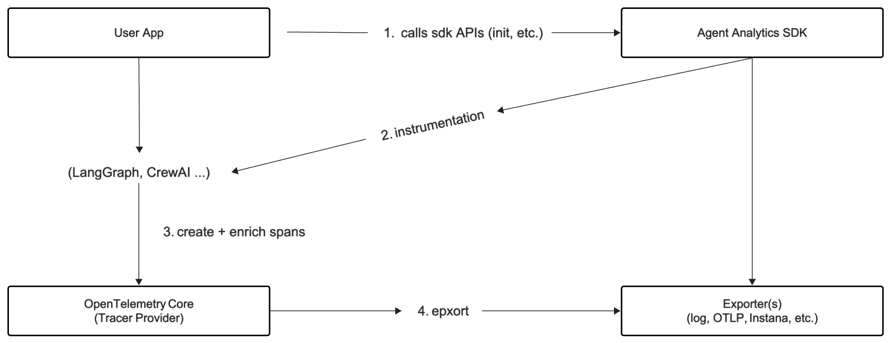

# Architecture

This document provides a high-level overview of the **Agent Analytics SDK** architecture, illustrating the primary modules, data flows, and key design considerations.

---

## High-Level Overview

The Agent Analytics SDK aims to provide a flexible, modular observability and tracing solution for LLM-based applications. It integrates with popular libraries such as **LangChain**, **OpenAI**, and **CrewAI**, among others.
Currently, the Agent Analytics SDK extends popular LLM tracing tools like [Traceloop](https://www.traceloop.com/) and [Langtrace](https://www.langtrace.ai/), adding improved semantics and additional functionalities.

**Key goals** of the architecture:
1. **Modularity**: Each feature (e.g., logging, metrics, or tracing) is isolated and can be enabled or disabled independently.
2. **Extensibility**: The design supports additional instrumentation modules as new frameworks and libraries emerge.
3. **Flexibility**: Users can easily swap tracer exporters (e.g., log file, OTLP, Instana) without altering application code extensively.

---

## Main Components

### 1. Instrumentation Layer
- **Location**: `src/agent_analytics/instrumentation/`
- **Purpose**: Houses instrumentors and patching logic to hook into third-party frameworks and libraries (LangChain, CrewAI, etc.).
- **Notable Modules**:
  - **`agent_analytics_sdk.py`**: Primary entry point for configuring the SDK (e.g., setting up exporters, logs directory, etc.).
  - **`traceloop/`**: Contains deeper integrations with the Traceloop telemetry framework, plus additional submodules for hooking into various libraries (`openai`, `anthropic`, `langchain`, etc.).
  - **`configs/`**: Contains configuration models (e.g., `TraceloopInstanaConfig`).

### 2. Core Tracing & Telemetry
- **Location**: Inside `instrumentation/traceloop/sdk/tracing/`
- **Purpose**: Provides the core logic for creating, managing, and exporting spans. Built on top of OpenTelemetry’s tracing and metrics APIs.
- **Key Classes**:
  - **`TracerWrapper`**: A wrapper around OpenTelemetry’s tracer provider for custom initialization, shutting down, or advanced instrumentation logic.
  - **`Traceloop.init`**: Central method to wire up the tracing system, including exporters, metrics, and loggers.

### 3. Integrations / Instrumentors
- **Location**: `instrumentation/traceloop/sdk/tracing/opentelemetry_instrumentation_*`
- **Purpose**: Each submodule (e.g., `opentelemetry_instrumentation_langchain`, `opentelemetry_instrumentation_crewai`) provides a custom instrumentor that patches relevant methods in the target framework. 
- **Flow**:
  1. The SDK user calls `Traceloop.init(...)`.
  2. Each instrumentor is optionally activated, hooking into library-specific logic to start/stop spans, record exceptions, etc.

### 4. Logging & Metrics
- **Logging**: By default, the `log` tracer type writes JSON-encoded span data to a `.log` file. The user can override the logs directory and file name. For remote solutions (e.g., Instana or OTLP), the logs are shipped off via a configured exporter.
- **Metrics**: Supported via OpenTelemetry’s metrics pipeline (optional). Certain instrumentors add token usage or performance metrics.

---

## Data Flow Diagram

Below is a conceptual diagram describing the data flow from user code through the SDK’s tracing logic and onward to the chosen exporter:

1. **User App** initializes or calls the SDK (via `agent_analytics_sdk.initialize_logging` or `Traceloop.init`).
2. The chosen **instrumentor** for each library patches relevant functions, collecting telemetry data during runtime (e.g., when an LLM is invoked).
3. **Spans** and metrics are created and enriched with helpful attributes (like model name, token usage, or crew tasks).
4. The **exporter** sends the data to a log file, Instana, or another endpoint.

---

## Comparing OTLP vs. Log Exporter

### OTLP Exporter

- **Protocol**: Uses the [OpenTelemetry Protocol (OTLP)](https://opentelemetry.io/docs/concepts/data-sources/#otlp) to send data (spans, metrics, logs) over gRPC or HTTP/protobuf.
- **Architecture**: Typically, you run an OpenTelemetry Collector or your own endpoint that receives OTLP data for further processing or shipping to backends like Jaeger, Tempo, or custom monitoring solutions.
- **Performance**: Often more efficient and suitable for production since data is batched and compressed.  
- **Use Cases**: Ideal when integrating with an existing distributed tracing or observability stack (e.g., you already have an OTEL Collector in your environment).  

### Log Exporter (File-Based)

- **Protocol**: None—just writes JSON-encoded spans (or logs) to a file on disk.  
- **Simplicity**: Very easy to set up—no external services or protocols required.  
- **Implementation**: The Agent Analytics SDK creates a `.log` file (or a file with the chosen filename) and appends each span as a JSON object.  
- **Use Cases**: Useful for local development, quick debugging, or offline analysis.  

---

## Extending the Architecture

1. **Adding a New Instrumentation**:
   - Create a new `opentelemetry_instrumentation_xyz` module under `traceloop/sdk/tracing/`.
   - Implement `BaseInstrumentor` from OpenTelemetry, patching the library’s core functionalities.
   - Hook the new instrumentor into `TracerWrapper` or `Traceloop.init`.

2. **Switching Exporters**:
   - Users can specify `tracer_type="log"` to write local logs, or use a `TraceloopInstanaConfig` to direct traces to Instana, or set `exporter=OTLPSpanExporter(...)` for OTLP.

3. **Custom Configuration**:
   - The design supports Pydantic-based config models (e.g., `TraceloopInstanaConfig`) for strongly typed configuration.
   - Additional environment variables (`TRACELOOP_*`) also override or supply dynamic configurations.

---

## Contributing

See the main [README.md](../README.md) for setup, testing, and development guidelines. For instrumentation-specific changes, ensure your new code:
- Follows the same approach as other submodules.
- Adheres to the coding conventions and error-handling patterns.
- Includes tests in `tests/` to validate the instrumentation logic.

---

## Summary

The **Agent Analytics SDK** architecture leverages a modular approach, allowing each instrumentation piece to remain decoupled while still flowing into a unified telemetry pipeline. By relying on OpenTelemetry under the hood, the SDK can support multiple exporters and advanced functionality like distributed tracing, all without forcing changes on the application developer.

